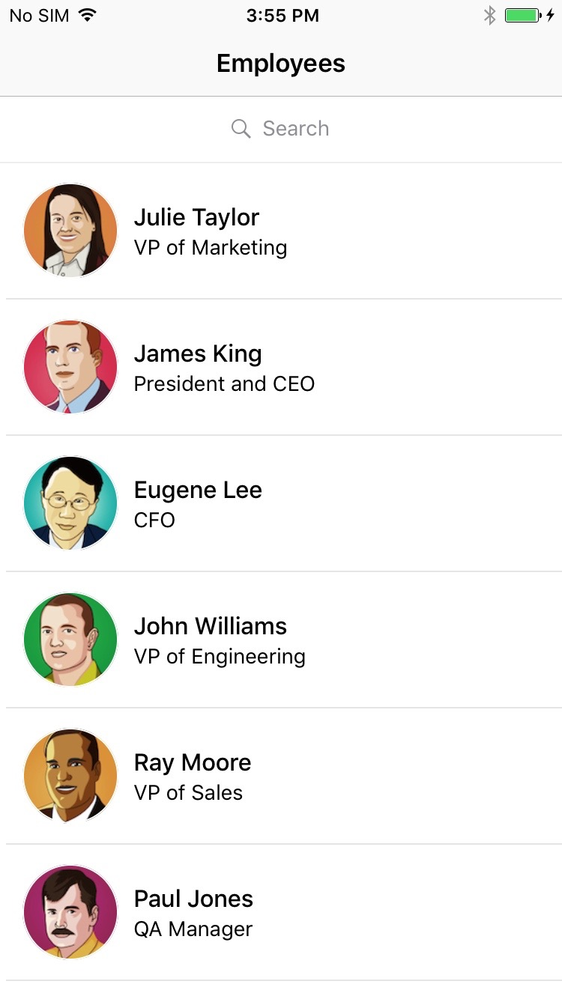

### Employee Directory Mobile App based on React Native




---

See [here](https://facebook.github.io/react-native/docs/getting-started.html#content) and [here](https://facebook.github.io/react-native/docs/android-setup.html#content) on how to setup react-native

### How to run
```
git clone ...
npm install
```

#### For ios

1. open `*.xcodeproj` in xcode

2. run in emulator

#### For android

1. Attach android phone to mac

2. run `react-native run-android`

3. See [here](https://facebook.github.io/react-native/docs/running-on-device-android.html#content) on how to debug on phone
